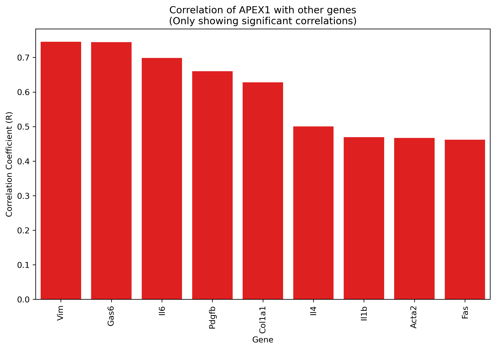
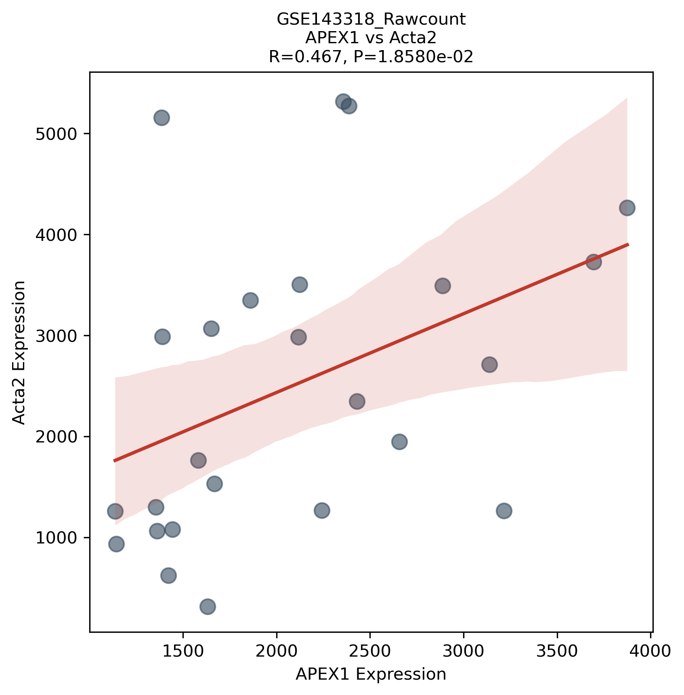

# 相关性分析

## 概述

相关性分析（`analysis_mode: "corr"`）计算目标基因与预定义的标志物基因集之间的 **Pearson 相关系数**，用于探索目标基因与已知生物学标志物的共表达模式。

标志物基因集 `hfm_dict` 预置了 5 大类共 18 个基因，覆盖肝纤维化常见通路：

| 类别 | 基因 | 生物学含义 |
|------|------|-----------|
| Classic | Acta2, Vim, Col1a1, Col3a1 | 经典纤维化标志物 |
| Inflammation | Il6, Tnfa, Il4, Il1b | 炎症因子 |
| Signaling_Advanced | Tem1, Arrb1, Gas6, Axl, Pdgfb | 高级信号通路 |
| Apoptosis | Fas, Fasl, Bcl2, Trp53 | 凋亡相关 |
| Hedgehog | Ptch1, Smo | Hedgehog 通路 |

> `hfm_dict` 硬编码在 `modules/calculater.py` 中。如需自定义标志物基因集，需修改源码。

## 输入数据

- **表达矩阵**：行 = 基因（Hugo_Symbol），列 = 样本
- **目标基因**：通过 `config.yaml` 中 `tar_gene`（单基因）或 `multi_gene`（多基因）指定
- 表达式自动 log2(x+1) 转换（若最大值 > `log_threshold`）

## 算法

`scipy.stats.pearsonr`，计算两个基因在所有共享样本上的 Pearson r 值和双尾 P 值。

预处理：
1. 两个基因向量按样本对齐（inner join）
2. 剔除 NaN
3. 检查：至少 3 个有效样本，且两向量标准差均 > 0（无效返回 None）

无多重检验校正。

## 配置项

| 配置 | 类型 | 默认值 | 说明 |
|------|------|--------|------|
| `tar_gene` | string | — | 目标基因（与 `multi_gene` 互斥） |
| `multi_gene` | string | — | 多基因输入（逗号分隔或文件路径） |
| `p_threshold` | float | 0.05 | 柱状图和散点图的 P 值过滤阈值 |
| `signs` | list | [positive, negative] | 散点图保留的相关性方向 |
| `analysis_mode` | string | diff | 设为 `"corr"` 启动 |

## 输出文件

| 文件 | 路径 | 说明 |
|------|------|------|
| 相关性结果 PKL | `data/{GSE_ID}/pkl/{GSE_ID}_correlation_summary.pkl` | DataFrame，5 列 |
| 相关性结果 CSV | `res/csv/{GSE_ID}_correlation_summary.csv` | 同上 |

### 输出列说明

| 列 | 说明 |
|----|------|
| `Matrix` | 表达矩阵名称 |
| `Category` | hfm_dict 类别 |
| `Gene` | 标志物基因名 |
| `R` | Pearson 相关系数 |
| `P_value` | 双尾 P 值 |

## 图表

### 相关性柱状图

- 过滤 `P_value < p_threshold` 的行
- 按 R 降序排列
- 红色 = 正相关，蓝色 = 负相关
- seaborn barplot，x 轴基因名旋转 90°
- 输出：`res/figures/corr/{GSE_ID}_{gene}_corr_correlation_barplot.png`

### 相关性散点图

- 过滤 `P_value < p_threshold` **且** R 符号与 `signs` 配置匹配的行
- 每对（目标基因，标志物基因）生成一张散点图
- seaborn regplot（95% 置信区间拟合线）
- X 轴：目标基因表达，Y 轴：标志物基因表达
- 标注 R 值（3 位小数）和 P 值（科学记数法）
- 输出：`res/figures/corr/{GSE_ID}_{gene}_corr_{matrix}_{marker}_corr_scatter.png`（每个基因一张）

## 常见问题

### Q: 如何自定义标志物基因集？

当前 `hfm_dict` 硬编码在 `modules/calculater.py:157`。如需修改，直接编辑该字典。常见场景：
- 换成其他疾病的 marker 基因
- 新增 / 删除某个类别
- 调整某个类别中的基因列表

### Q: 散点图为什么一张也没生成？

检查：
1. `p_threshold` 是否设置过严（默认 0.05），导致所有行被过滤
2. `signs` 是否排除了所有结果（例如 `signs: [positive]` 但只有负相关结果）
3. 控制台日志会提示筛选条件和保留行数

### Q: 多基因模式下的输出有什么区别？

`multi_gene` 模式下，每个目标基因独立生成柱状图和散点图，文件名中 token 为 `multi_Ngenes`。

## 示例

以下示例基于 `GSE143318`，目标基因 `APEX1`。

### 输入

表达矩阵：27 个样本 × 基因，`tar_gene: "APEX1"`。标志物基因集使用内置 `hfm_dict`（5 类 18 基因）。

### 输出：相关性结果表（`res/csv/GSE143318_correlation_summary.csv`）

```csv
Matrix,Category,Gene,R,P_value
GSE143318_Rawcount.txt.gz,Classic,Acta2,0.467,0.0186
GSE143318_Rawcount.txt.gz,Classic,Vim,0.746,1.89e-05
GSE143318_Rawcount.txt.gz,Classic,Col1a1,0.628,0.000773
GSE143318_Rawcount.txt.gz,Inflammation,Il6,0.512,0.0085
...
```

### 输出：柱状图



### 输出：散点图（示例：APEX1 vs Acta2）


