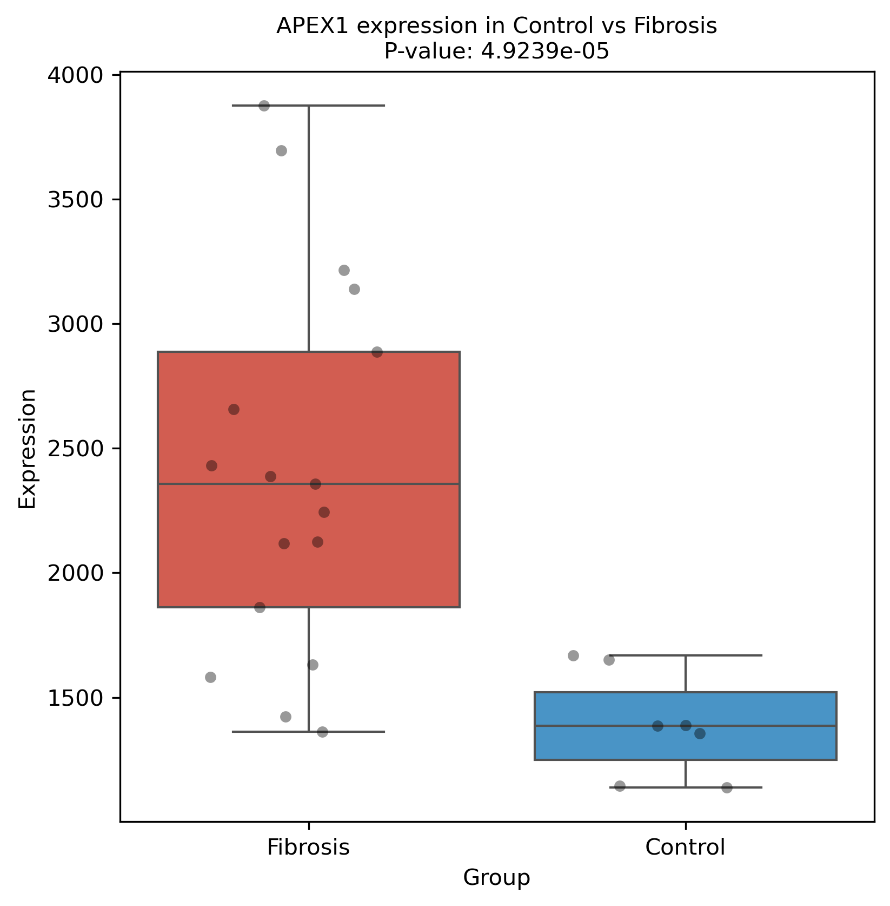
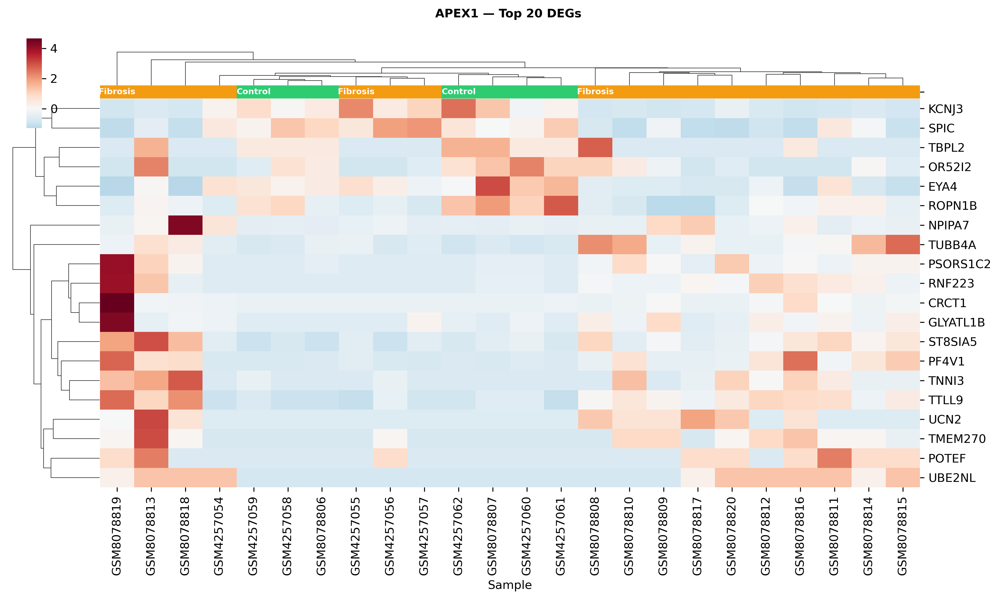
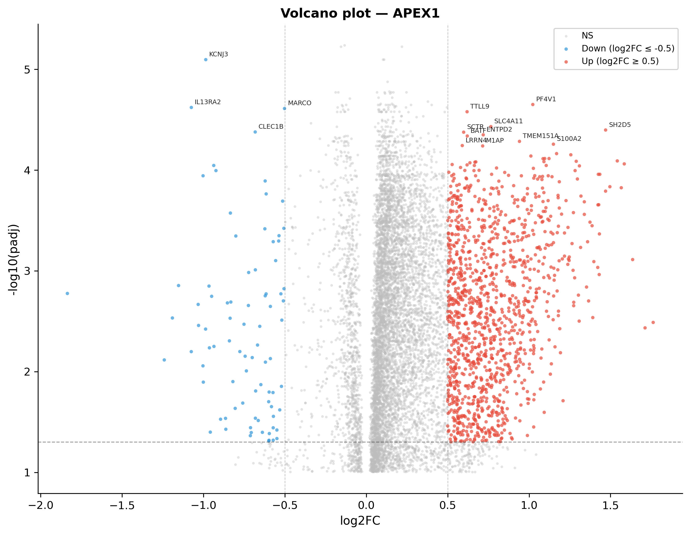
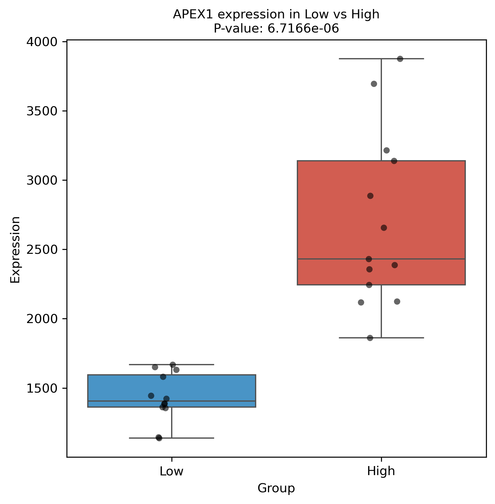

# 差异分析 & 高低表达分析

## 概述

差异分析（`analysis_mode: "diff"`）和高低表达分析（`analysis_mode: "hilo"`）用于识别不同分组间的差异表达基因（DEGs）。

| 模式 | 分组逻辑 | 对比方向 |
|------|----------|----------|
| **diff** | Control vs Experiment（由 `control_label` / `exp_label` 配置决定） | Experiment - Control |
| **hilo** | 按目标基因中位表达值将样本分为 Low / High 组 | High - Low |

两者共享相同的统计引擎（Welch t-test + Benjamini-Hochberg FDR），hilo 本质是 `DiffStrategy` 的轻量包装。

## 输入数据

- **表达矩阵**：行 = 基因，列 = 样本
- **元数据**：`meta` DataFrame，含 `group` 列（Control / Experiment 或 Low / High）
- 自动 log2(x+1) 转换（若最大值 > `log_threshold`）

## 算法

### Welch t-test

`scipy.stats.ttest_ind(axis=1, equal_var=False, nan_policy='omit')`，逐行计算两组样本间的差异显著性。

- 不假设两组方差相等（Welch 校正）
- 每行要求 Control 和 Experiment 组各至少有 3 个非 NaN 样本
- 双尾检验

### 多重检验校正

`statsmodels.stats.multitest.fdrcorrection`（Benjamini-Hochberg FDR），对原始 P 值逐行校正得到 `padj`。

### log2FC 计算

- **数据已 log 转换**：`log2FC = mean(实验组) - mean(对照组)`
- **数据未 log 转换**：`log2FC = log2(mean(实验组) + 1) - log2(mean(对照组) + 1)`

## 预处理过滤

计算前会对表达矩阵做以下清洗：

1. 剔除基因名为空、NaN、纯数字的行
2. 剔除探针 ID（如 `ILMN_`、`AFFY-` 等前缀）
3. 剔除非编码 RNA（miRNA、snoRNA、lncRNA、假基因等）
4. 剔除 `gene_blacklist` 中的基因
5. 同基因名按最大平均表达去重

当 `tar_tuple` 启用时（如 `"mirna"`），跳过步骤 2-3，改为正向正则匹配。

## 结果过滤（`_clean_diff_results`）

计算完成后，根据 `strict_filter` 配置进行两层清洗：

### 严格模式（`strict_filter: true`，默认）

`padj < p_threshold`，仅保留 FDR 校正后显著的基因。

### 宽松模式（`strict_filter: false`）

- **diff 模式**：`P_value < p_threshold` **且** `|log2FC| > log2fc_threshold`
- **hilo 模式**：仅 `P_value < p_threshold`（不限制 log2FC）

之后可选按 `max_output_genes` 截断（按 padj / P_value 升序取 top N，0 = 不限制）。

## 配置项

| 配置 | 类型 | 默认值 | 适用模式 | 说明 |
|------|------|--------|----------|------|
| `analysis_mode` | string | diff | 两者 | `"diff"` 或 `"hilo"` |
| `tar_gene` | string | — | 两者 | 目标基因（hilo 用于确定中位分组） |
| `p_threshold` | float | 0.05 | 两者 | 显著性阈值 |
| `strict_filter` | bool | true | 两者 | 严格 / 宽松过滤模式 |
| `log2fc_threshold` | float | 0.0 | diff | 宽松模式下最小 |log2FC|（设为 0 关闭） |
| `max_output_genes` | int | 0 | 两者 | 最大保留基因数（0 = 不限制） |
| `gene_blacklist` | list | [] | 两者 | 排除基因列表 |
| `tar_tuple` | string | "" | 两者 | 基因类别筛选（如 `"mirna"`） |
| `control_label` | list | ["control"] | diff | 识别 Control 组的关键词 |
| `exp_label` | list | ["CCl4"] | diff | 识别实验组的关键词 |
| `exp_type` | string | Fibrosis | 两者 | 实验组显示名称 |
| `group_select_col` | string | source_name_ch1 | diff | 分组依据列 |

## 输出文件

| 文件 | 路径 | 说明 |
|------|------|------|
| 原始结果 CSV | `res/csv/{GSE_ID}_differential_summary_raw.csv` | 未过滤的全部 DEGs |
| 最终结果 PKL | `data/{GSE_ID}/pkl/{GSE_ID}_differential_summary.pkl` | 过滤后的 DEGs（diff） |
| 最终结果 PKL | `data/{GSE_ID}/pkl/{GSE_ID}_highlow_summary.pkl` | 过滤后的 DEGs（hilo） |

### 输出列说明

| 列 | 说明 |
|----|------|
| `Gene` | 基因名 |
| `log2FC` | log2 倍数变化（实验组 vs 对照组） |
| `P_value` | Welch t-test 原始 P 值 |
| `padj` | Benjamini-Hochberg 校正后 P 值 |

## 图表

### diff 模式

| 图 | 方法 | 说明 |
|----|------|------|
| 差异箱线图 | `box_plotter()` | 每个 top DEG 在 Control vs Experiment 的表达分布 |
| 聚类热图 | `heatmap_plotter()` | top 20 DEGs 的 Z-score 聚类热图 + 分组颜色条 |

### hilo 模式（额外包含）

| 图 | 方法 | 说明 |
|----|------|------|
| 火山图 | `volcano_plotter()` | log2FC vs -log10(padj)，上/下调着色，标注 top 15 基因 |
| 差异箱线图 | `box_plotter()` | Low vs High 表达分布 |
| 聚类热图 | `heatmap_plotter()` | top 20 DEGs + 目标基因 |

火山图着色规则：
- 红色（Up）：`padj < p_threshold` 且 `log2FC >= log2fc_threshold`
- 蓝色（Down）：`padj < p_threshold` 且 `log2FC <= -log2fc_threshold`
- 灰色（NS）：不显著

## diff vs hilo 对比

| 属性 | diff | hilo |
|------|------|------|
| 分组方式 | 元数据驱动 | 目标基因中位表达驱动 |
| 统计检验 | Welch t-test | Welch t-test（复用 DiffStrategy） |
| 多重校正 | BH-FDR | BH-FDR |
| log2FC 方向 | Experiment - Control | High - Low |
| 输出文件结尾 | `differential_summary` | `highlow_summary` |
| 火山图 | 无 | 有 |
| 适用场景 | 已知分组的实验设计 | 无预设分组，探索基因表达分层 |

## 常见问题

### Q: 严格模式和宽松模式怎么选？

- **严格模式**（`strict_filter: true`）：适合正式分析，结果更保守可靠，适合后续富集分析
- **宽松模式**（`strict_filter: false`）：适合探索性分析，保留更多候选基因，但假阳性率更高

### Q: hilo 模式不生成火山图？

hilo 才会生成火山图，diff 不生成。如果需要 diff 的火山图，可以手动用原始 CSV 数据画图。

### Q: log2FC 阈值设为 0 是什么意思？

表示不做倍数变化过滤（仅对 diff 宽松模式有意义）。设为 0.5 或 1 可筛除非生物学显著变化。

### Q: 输出基因太多怎么办？

设置 `max_output_genes` 限制 top N。

## 示例

以下示例基于 `GSE143318`，目标基因 `APEX1`，分组：Control（normal）vs Fibrosis（CCl4 处理）。

### 输入

表达矩阵：27 个样本 × 基因。`control_label: ["control"]`，`exp_label: ["CCl4"]`，`strict_filter: true`。

### 输出：差异结果表（`res/csv/GSE143318_differential_summary.csv`）

```csv
Gene,log2FC,P_value,padj
ZFY,-0.563,0.00965,0.267
TTTY14,-0.525,0.0139,0.288
PI15,0.574,0.0227,0.328
WNT10A,0.562,0.0374,0.380
...
```

### 输出：diff 箱线图



### 输出：diff 热图



### 输出：hilo 火山图



### 输出：hilo 箱线图

设为 0 则不限制。基因按 padj（严格模式）或 P_value（宽松模式）升序排列后截断。
