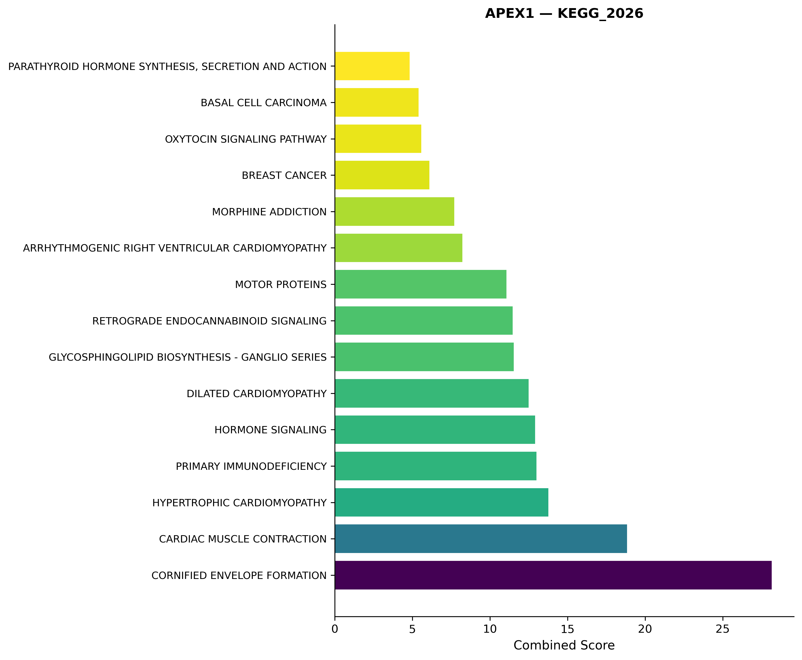
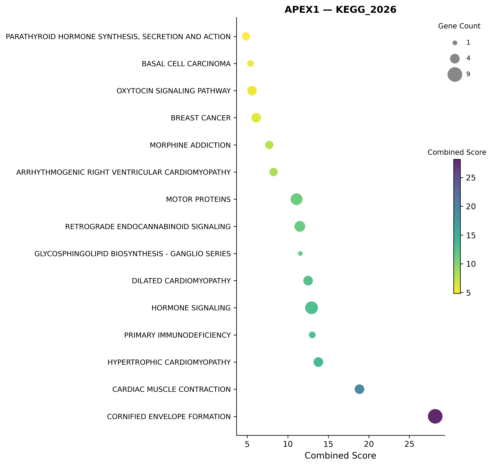
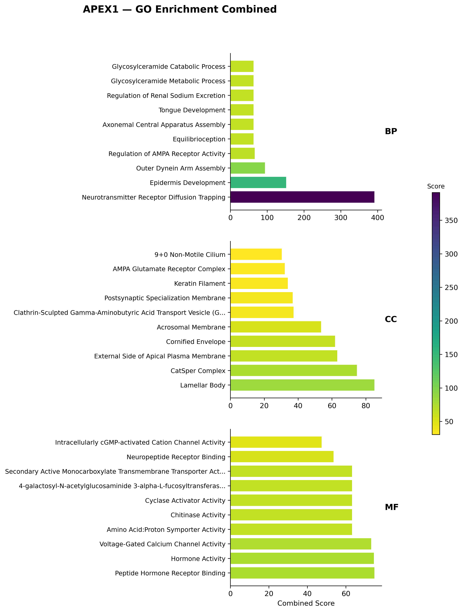

# 通路富集分析

## 概述

富集分析（`analysis_mode: "enrich"`）对差异分析或高低表达分析的显著基因列表进行 KEGG / GO 等通路富集，揭示差异基因参与的主要生物学过程和信号通路。

使用 [Enrichr](https://maayanlab.cloud/Enrichr/) Web API（通过 `gseapy` 库），无需本地数据库。

## 输入数据

富集分析有两种输入方式：

### 方式一：multi_gene 直接输入（推荐，无需表达数据）

直接在配置中设置 `multi_gene`，富集分析将跳过 diff/hilo 源文件，直接使用指定基因列表调用 Enrichr：

```yaml
analysis_mode: enrich
multi_gene: TP53,EGFR,KRAS,BRAF,PIK3CA   # YAML内用逗号；命令行用 _
# 或从文件读取（每行一个基因，# 开头为注释）
# multi_gene: "./my_genes.txt"
```

基因列表会自动去重，若超过 `max_input_genes`（默认 500）则截断。

> `multi_gene` 与 `tar_gene` 互斥。`tar_gene` 仅支持单个基因，对富集分析意义不大，建议使用 `multi_gene`。

### 方式二：从 diff/hilo 结果读取

设置 `enrichment_source_mode` 为 `"diff"` 或 `"hilo"`，从已有的分析结果中读取基因：

- PKL 路径（优先）：`data/{GSE_ID}/pkl/{GSE_ID}_differential_summary.pkl`
- CSV 路径（回退）：`res/csv/{GSE_ID}_differential_summary.csv`

来源由 `enrichment_source_mode` 控制（`"diff"` 或 `"hilo"`）。

### 基因筛选流程（仅 source 模式）

以下流程仅在从 diff/hilo 结果读取时适用（`multi_gene` 直接输入时跳过，仅做去重和截断）：

1. 清洗无效基因名（NaN、空字符串、纯数字 Entrez ID、探针 ID）
2. 按 `padj < p_threshold` 筛选（若 `log2fc_threshold > 0` 则额外要求 `|log2FC| >= log2fc_threshold`）
3. 按基因名去重
4. 若显著基因不足 10 个：回退到全量基因按 `|log2FC|` 降序取 top `max_input_genes`
5. 若超过 `max_input_genes`：按 `|log2FC|` 降序截断

## 算法

`gseapy.enrichr()`，对每个配置的 gene set library 分别调用：

```python
gseapy.enrichr(
    gene_list=gene_list,
    gene_sets="KEGG_2026",
    organism="human",
    cutoff=0.05,
    outdir=None,
    no_plot=True,
)
```

- 纯 HTTP 调用 Enrichr 公开 API
- 无本地计算，需联网

### 结果去重

同一 gene set 内的结果按以下规则去重（保留较短 Term）：

1. **指纹匹配**：Adjusted P-value / Odds Ratio / Combined Score 相同（6 位小数），且 Overlap / Genes 完全一致
2. **分数接近**：Combined Score 相同（2 位小数），且 Overlap 字符串一致
3. **基因重叠高**：两个 Term 的基因列表重叠 ≥ 80%

## 配置项

| 配置 | 类型 | 默认值 | 说明 |
|------|------|--------|------|
| `analysis_mode` | string | diff | 设为 `"enrich"` 启动 |
| `enrichment_source_mode` | string | diff | 基因来源：`"diff"` 或 `"hilo"` |
| `enrichment_gene_sets` | list | [KEGG_2026, GO_BP_2025, GO_MF_2025, GO_CC_2025] | Enrichr 基因集库列表 |
| `organism` | string | human | 物种（human / mouse / rat） |
| `max_input_genes` | int | 500 | 提交给 Enrichr 的最大基因数 |
| `p_threshold` | float | 0.05 | 显著基因筛选阈值 |
| `log2fc_threshold` | float | 0.5 | 最小倍数变化（设为 0 不限制） |

> 可用 `python -c "import gseapy; print(gseapy.get_library_name())"` 查看所有可用的 Enrichr 基因集库。

## 输出文件

| 文件 | 路径 | 说明 |
|------|------|------|
| 富集结果 PKL | `data/{GSE_ID}/pkl/{GSE_ID}_enrichment_summary.pkl` | 合并所有 gene set 的 DataFrame |
| 富集结果 CSV | `res/csv/{GSE_ID}_enrichment_summary.csv` | 同上 |
| 绘图数据 CSV | `res/csv/{GSE_ID}_{gene}_enrich_plotting_data.csv` | 供下游分析使用的处理后数据 |

### 输出列说明

输出包含 gseapy `res2d` 的所有列（`Term`、`Overlap`、`P-value`、`Adjusted P-value`、`Odds Ratio`、`Combined Score`、`Genes`），外加 `Gene_set` 列标注来源库。

## 图表

所有图表输出至 `res/figures/enrich/`。

### 富集条形图

- 每个 gene set 一张图（KEGG 取 top 10，其他取 top 15）
- 横条高度 = Combined Score 或 -log10(Adjusted P-value)
- viridis_r 渐变色
- 文件名：`{GSE_ID}_{gene}_{gene_set}_barplot.png`

### 富集气泡图

- 每个 gene set 一张图
- 气泡大小 = 基因数（从 Overlap 提取），颜色 = Combined Score
- 文件名：`{GSE_ID}_{gene}_{gene_set}_dotplot.png`

### GO 合集图

- 仅对 GO_BP、GO_CC、GO_MF 生成
- 三栏垂直排布 + 右侧共享颜色条
- 各取 top 10，标签缩写标注 BP / CC / MF
- 文件名：`{GSE_ID}_{gene}_GO_combined_bar.png`

## 常见问题

### Q: 运行富集分析需要先做什么？

**若使用 `multi_gene` 直接输入**：无需任何前置分析，直接配置 `multi_gene` + `analysis_mode: enrich` 即可运行。

**若从 diff/hilo 结果读取**：需要先在同 GSE_ID 下运行一次 `diff` 或 `hilo` 分析（生成 `differential_summary.pkl` 或 `highlow_summary.pkl`）。否则会报 `FileNotFoundError`。

可通过 `SGA config enrichment_source_mode` 查看当前配置的输入来源。

### Q: 显著基因太少（< 10）怎么办？

系统会自动回退：不再用 `padj < p_threshold` 过滤，改为全量基因按 `|log2FC|` 降序取 top `max_input_genes`。这说明该数据集的组间差异较小，富集结果可能不够显著，建议在讨论中说明。

### Q: Enrichr API 调用失败怎么处理？

单个 gene set 请求失败时，错误会被 catch 并记录日志，循环继续处理其他 gene set。如果全部失败，结果为空 DataFrame。常见原因：
- 网络问题（需联网访问 maayanlab.cloud）
- 基因列表过长（控制 `max_input_genes`）
- 使用了不存在的 gene set 名称

### Q: 如何添加其他数据库（如 Reactome、WikiPathways）？

在 `config.yaml` 中修改 `enrichment_gene_sets`：

```yaml
enrichment_gene_sets:
  - KEGG_2026
  - Reactome_2022
  - WikiPathway_2024_Human
```

运行 `python -c "import gseapy; print(gseapy.get_library_name())"` 查看完整列表。

## 示例

以下示例基于 `GSE143318`，目标基因 `APEX1`，输入来源为 diff 结果。

### 输入

从 `GSE143318_differential_summary.pkl` 读取，`enrichment_source_mode: "diff"`，`p_threshold: 0.05`，`log2fc_threshold: 0.5`，`max_input_genes: 500`。

### 输出：富集结果表（`res/csv/GSE143318_enrichment_summary.csv`）

```csv
Gene_set,Term,Overlap,P-value,Adjusted P-value,Odds Ratio,Combined Score
KEGG_2026,PHAGOSOME,3/151,0.246,0.885,1.78,2.49
KEGG_2026,MELANOMA,1/72,0.561,0.885,1.23,0.71
KEGG_2026,APOPTOSIS,1/136,0.789,0.885,0.64,0.15
...
```

### 输出：KEGG 富集条形图



### 输出：KEGG 富集气泡图



### 输出：GO 合集图


